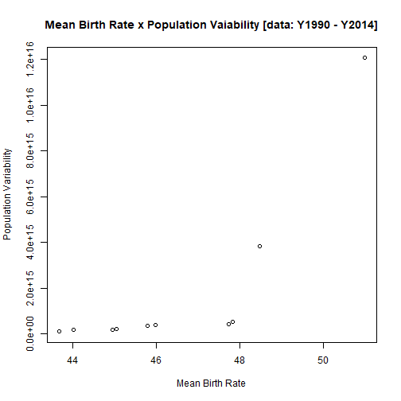
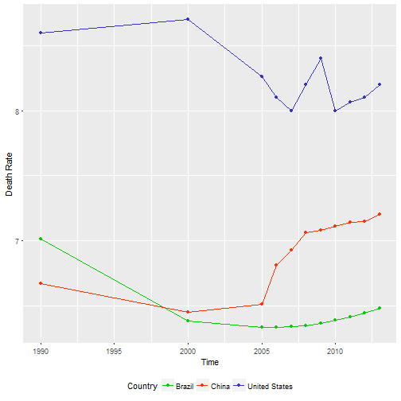
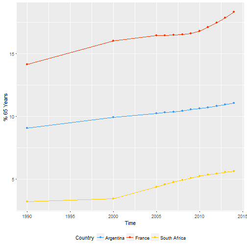

Population Key - Analise Geral
========================================================
author: Guilherme Lourenco - RA: 1700851
date: BI-15 - Analise Exploratoria de Dados
autosize: true

<style>
body {
    overflow: scroll;
}
</style>

Questao A [CODIGOS]
========================================================
Lista de paises (top 20) com as maiores taxas medias de natalidade, entre 1990 a 2014


```r
#Subset based on TIME
pop1990_to_2014 <- subset((population_key[which(population_key$Time >= 1990 & population_key$Time <= 2014),]))

#Subset based on Country, Time and Birth Rate
popCountry_and_BirthRate <- subset(pop1990_to_2014[,c("Country.Name","Time","Birth.rate..crude..per.1.000.people...SP.DYN.CBRT.IN.")],!is.na(pop1990_to_2014$Birth.rate..crude..per.1.000.people...SP.DYN.CBRT.IN.))

#Calculate Mean
popMean_by_Country_and_BirthRate <- aggregate(popCountry_and_BirthRate$Birth.rate..crude..per.1.000.people...SP.DYN.CBRT.IN. ~ popCountry_and_BirthRate$Country.Name, popCountry_and_BirthRate, mean )
names(popMean_by_Country_and_BirthRate) <- c("Country","Mean")

#Subset the top 20 Medians
RankTOP20BirthMeans <- popMean_by_Country_and_BirthRate[order(popMean_by_Country_and_BirthRate$Mean, decreasing = TRUE),]
RankTOP20BirthMeans <- subset(RankTOP20BirthMeans[1:20,])
```

Questao A [RESULTADO]
========================================================


```r
RankTOP20BirthMeans
```

```
             Country     Mean
140            Niger 50.98145
38              Chad 48.47009
121             Mali 47.81745
6             Angola 47.73400
171          Somalia 45.97582
195           Uganda 45.78073
44  Congo. Dem. Rep. 45.04782
31           Burundi 44.94645
70       Gambia. The 44.01736
30      Burkina Faso 43.67227
208           Zambia 43.63136
118           Malawi 42.35855
141          Nigeria 42.25527
132       Mozambique 41.81764
1        Afghanistan 41.43709
186         Tanzania 41.19136
165     Sierra Leone 39.91909
80     Guinea-Bissau 39.67518
34          Cameroon 39.67418
79            Guinea 39.57845
```

Questao B [CODIGOS]
========================================================
Lista de paises (top 20) com as menores taxas medias de natalidade, entre 1990 a 2014


```r
#Subset the bottom 20 Medians
RankBOTTOM20BirthMeans <- popMean_by_Country_and_BirthRate[order(popMean_by_Country_and_BirthRate$Mean, decreasing = FALSE),]
RankBOTTOM20BirthMeans <- subset(RankBOTTOM20BirthMeans[1:20,])
```

Questao B [RESULTADO]
========================================================


```r
RankBOTTOM20BirthMeans
```

```
                   Country      Mean
72                 Germany  8.654545
96                   Japan  8.681208
25  Bosnia and Herzegovina  9.293455
163                 Serbia  9.430000
94                   Italy  9.454545
12                 Austria  9.609091
85                 Hungary  9.690909
74                  Greece  9.809091
152               Portugal  9.818182
48                 Croatia  9.844818
29                Bulgaria  9.972727
115       Macao SAR. China 10.020727
159             San Marino 10.150000
102            Korea. Rep. 10.181818
39         Channel Islands 10.189545
169               Slovenia 10.236364
113              Lithuania 10.254545
122                  Malta 10.290909
174                  Spain 10.336364
107                 Latvia 10.345455
```

Questao C [CODIGOS]
========================================================
Ranking de paises (top 50) com maior populacao, considerando dados de 2014


```r
#Subsets; Population & Order Population
Rank50paises <- subset((population_key[which(population_key$Time == 2014),c(1,5)]))
Rank50paises <- Rank50paises[order(Rank50paises$Population..total..SP.POP.TOTL., decreasing = TRUE),]
Rank50paises <- subset(Rank50paises[1:50,])

#Rename Fields
names(Rank50paises) <- c("Paises", "Populacao Total")
```

Questao C [RESULTADO]
========================================================


```r
Rank50paises
```

```
                 Paises Populacao Total
492               China      1364270000
1044              India      1267401849
2460      United States       318857056
1056          Indonesia       252812245
324              Brazil       202033670
1752           Pakistan       185132926
1704            Nigeria       178516904
192          Bangladesh       158512570
1896 Russian Federation       143819569
1152              Japan       127131800
1512             Mexico       123799215
1824        Philippines       100096496
756            Ethiopia        96506031
2520            Vietnam        90730000
696    Egypt. Arab Rep.        83386739
864             Germany        80889505
1068 Iran. Islamic Rep.        78470222
2364             Turkey        75837020
528    Congo. Dem. Rep.        69360118
2292           Thailand        67222972
804              France        66201365
2448     United Kingdom        64510376
1128              Italy        61336387
2088       South Africa        54001953
1608            Myanmar        53718958
2280           Tanzania        50757459
1224        Korea. Rep.        50423955
504            Colombia        48929706
2112              Spain        46404602
1188              Kenya        45545980
2424            Ukraine        45362900
96            Argentina        41803125
36              Algeria        39928947
2412             Uganda        38844624
2184              Sudan        38764090
1836             Poland        37995529
420              Canada        35540419
1080               Iraq        34278364
1584            Morocco        33492909
12          Afghanistan        31280518
2508      Venezuela. RB        30851343
1812               Peru        30769077
2484         Uzbekistan        30742500
1428           Malaysia        30187896
1956       Saudi Arabia        29369428
1632              Nepal        28120740
1596         Mozambique        26472977
876               Ghana        26442178
1212   Korea. Dem. Rep.        25026588
2556        Yemen. Rep.        24968508
```

Questao D [CODIGOS]
========================================================
Lista de paises (top 20) com maior variabilidade de populacao, entre 1990 e 2014

```r
#Subset Country and Variation
popCountry_Variation <- subset(pop1990_to_2014[,c("Country.Name","Time","Population..total..SP.POP.TOTL.")])

#Calculate Variation
popVar_by_Country_and_Population <- aggregate(popCountry_Variation$Population..total..SP.POP.TOTL. ~ popCountry_Variation$Country.Name, popCountry_Variation, var )
names(popVar_by_Country_and_Population) <- c("Country","Variation")

#Subset the top 20 Medians
RankTOP20PopVar <- popVar_by_Country_and_Population[order(popVar_by_Country_and_Population$Variation, decreasing = TRUE),]
RankTOP20PopVar <- subset(RankTOP20PopVar[1:20,])
```

Questao D [RESULTADO]
========================================================


```r
RankTOP20PopVar
```

```
               Country    Variation
87               India 1.206677e+16
41               China 3.846873e+15
142            Nigeria 5.369004e+14
88           Indonesia 4.249183e+14
146           Pakistan 4.122717e+14
204      United States 3.626172e+14
27              Brazil 2.081840e+14
16          Bangladesh 1.924163e+14
63            Ethiopia 1.811558e+14
152        Philippines 1.100640e+14
126             Mexico 1.051480e+14
44    Congo. Dem. Rep. 9.236130e+13
58    Egypt. Arab Rep. 5.693966e+13
189           Tanzania 4.953255e+13
209            Vietnam 4.512671e+13
99               Kenya 3.773092e+13
89  Iran. Islamic Rep. 3.616642e+13
196             Turkey 3.614023e+13
200             Uganda 3.586416e+13
1          Afghanistan 2.880682e+13
```

Questao E [CODIGOS]
========================================================
Ha alguma coincidEncia entre os paIses top10 em natalidade e os top10 em variabilidade de populacao, considerando o periodo entre 1990e 2014


```r
#Subset top 10 Birth
top10Birth <- popMean_by_Country_and_BirthRate[order(popMean_by_Country_and_BirthRate$Mean, decreasing = TRUE),]
top10Birth <- subset(top10Birth[1:10,])
names(top10Birth) <- c("Country", "MeanBirth Rate")


#Subset top 10 Variability
top10Variability <- popVar_by_Country_and_Population[order(popVar_by_Country_and_Population$Variation, decreasing = TRUE),]
top10Variability <- top10Variability[1:10,]
```

Questao E [RESULTADO]
========================================================


```r
plot(top10Birth$`MeanBirth Rate`, top10Variability$Variation,
    main = "Mean Birth Rate x Population Vaiability [data: Y1990 - Y2014]",
    xlab = "Mean Birth Rate",
    ylab = "Population Variability")
```



Questao F [CODIGOS]
========================================================
Lista de paises (top 20) com os maiores % medios de populacao acima de 65 anos, considerando o periodo entre 1990 e 2014.


```r
#Subset based on Country, Time and 65 Age
popCountry_and_65Age <- subset(pop1990_to_2014[,c("Country.Name","Time","Population.ages.65.and.above....of.total...SP.POP.65UP.TO.ZS.")],!is.na(pop1990_to_2014$Population.ages.65.and.above....of.total...SP.POP.65UP.TO.ZS.))

#Calculate Mean
popMean_by_Country_and_65Age <- aggregate(popCountry_and_65Age$Population.ages.65.and.above....of.total...SP.POP.65UP.TO.ZS. ~ popCountry_and_65Age$Country.Name, popCountry_and_65Age, mean )
names(popMean_by_Country_and_65Age) <- c("Country","Mean")

#Subset the top 20 Medians
RankTOP20AgeMeans <- popMean_by_Country_and_65Age[order(popMean_by_Country_and_65Age$Mean, decreasing = TRUE),]
RankTOP20AgeMeans <- subset(RankTOP20AgeMeans[1:20,])
```

Questao F [RESULTADO]
========================================================


```r
RankTOP20AgeMeans
```

```
           Country     Mean
88           Japan 21.35356
86           Italy 19.73628
66         Germany 19.63320
68          Greece 18.45857
168         Sweden 18.12451
26        Bulgaria 17.77283
141       Portugal 17.48084
99          Latvia 17.34224
17         Belgium 17.18647
10         Austria 17.11763
44         Croatia 16.96326
161          Spain 16.85978
60         Finland 16.81259
57         Estonia 16.81224
61          France 16.68302
184 United Kingdom 16.51481
169    Switzerland 16.51131
49         Denmark 16.35492
78         Hungary 16.20262
156       Slovenia 15.84381
```

Questao G [CODIGOS]
========================================================
Lista de paises (top 20) com os menores % medios de populacao acima de 65 anos, considerando o periodo entre 1990 e 2014.


```r
#Subset the bottom 20 Medians
RankBOTTOM20AgeMeans <- popMean_by_Country_and_65Age[order(popMean_by_Country_and_65Age$Mean, decreasing = FALSE),]
RankBOTTOM20AgeMeans <- subset(RankBOTTOM20AgeMeans[1:20,])
```

Questao G [RESULTADO]
========================================================


```r
RankBOTTOM20AgeMeans
```

```
                 Country      Mean
183 United Arab Emirates 0.5720584
143                Qatar 1.1930224
56               Eritrea 2.0448615
1            Afghanistan 2.1411343
13               Bahrain 2.1666552
146               Rwanda 2.4020390
4                 Angola 2.4434505
96                Kuwait 2.4715168
181               Uganda 2.4888028
64           Gambia. The 2.5293443
133                 Oman 2.5382522
130                Niger 2.5553874
27          Burkina Faso 2.5788541
153         Sierra Leone 2.5794282
34                  Chad 2.6083323
28               Burundi 2.6116499
192   West Bank and Gaza 2.6665551
91                 Kenya 2.6722242
194               Zambia 2.6774471
136     Papua New Guinea 2.7101721
```

Questao H [CODIGOS]
========================================================
Alguma concentracao continental nas ultimas duas listas (itens (f) e (g))? Explique.


```r
#Merge Continents info related to the Country [Continents is a new dataset imported]
ContTOP20AgeMeans <- merge(RankTOP20AgeMeans, continents, by.x = "Country", by.y = "Country")
ContBOTTOM20AgeMeans <- merge(RankBOTTOM20AgeMeans, continents, by.x = "Country", by.y = "Country")

#Mode Function to find the concentration in each option
findMode <- function(x){ 
  ta = table(x)
  tam = max(ta)
  if (all(ta == tam))
    mod = NA
  else
    if(is.numeric(x))
      mod = as.numeric(names(ta)[ta == tam])
  else
    mod = names(ta)[ta == tam]
  return(mod)
}
```

Questao H [RESULTADO]
========================================================


```r
#Related to the TOP 20 Age Means we have the concentration in "Europe"
findMode(ContTOP20AgeMeans$Continents)
```

```
[1] "Europa"
```

```r
#Related to the BOTTOM 20 Age Means we have the concentration in "Africa"
findMode(ContBOTTOM20AgeMeans$Continents)
```

```
[1] "Africa"
```

Questao I [CODIGOS]
========================================================
Mostre , compare e analise a evolucao historica das taxas de mortalidade, entre 1990 e 2014, para o Brasil, Estados Unidos e China.


```r
#Subsetting data related to the Country filter [Brazil - United States - China]
popDeathRate_by_Country <- subset(pop1990_to_2014[which(pop1990_to_2014$Country.Code == "BRA" | pop1990_to_2014$Country.Code == "USA" | pop1990_to_2014$Country.Code == "CHN"),c("Country.Name","Time","Death.rate..crude..per.1.000.people...SP.DYN.CDRT.IN.")])
popDeathRate_by_Country <- na.omit(popDeathRate_by_Country)
names(popDeathRate_by_Country) <- c("Country", "Time", "Death Rate")

#Sets the ggplot Line Chart
DeathRate <- ggplot(data = popDeathRate_by_Country, aes(x = Time, y = `Death Rate`, group = Country))+
            geom_line(aes(color=Country)) +
            geom_point(aes(color=Country))
```

Questao I [RESULTADO]
========================================================


```r
#Shows graphically the data and updates the legend
DeathRate + theme(legend.position="bottom") + scale_color_manual(values=c("#00cc00", "#ff3300", "#3333cc"))
```



Questao J [CODIGOS]
========================================================
Mostre , compare e analise a evolucao historica do % de populacao >65 anos, entre 1990 e 2014, para a Franca, Argentina e Africa do Sul.


```r
#Subsetting data related to the Country filter [France - Argentina - South Africa]
pop65Perc_by_Country <- subset(pop1990_to_2014[which(pop1990_to_2014$Country.Code == "FRA" | pop1990_to_2014$Country.Code == "ARG" | pop1990_to_2014$Country.Code == "ZAF"),c("Country.Name","Time","Population.ages.65.and.above....of.total...SP.POP.65UP.TO.ZS.")])
pop65Perc_by_Country <- na.omit(pop65Perc_by_Country)
names(pop65Perc_by_Country) <- c("Country", "Time", "% 65 Years")

#Sets the ggplot Line Chart
g65Perce <- ggplot(data = pop65Perc_by_Country, aes(x = Time, y = `% 65 Years`, group = Country))+
           geom_line(aes(color=Country)) +
           geom_point(aes(color = Country))
```

Questao J [RESULTADO]
========================================================


```r
#Shows graphically the data and updates the legend
g65Perce + theme(legend.position="bottom") + scale_color_manual(values=c("#3399ff", "#ff3300", "#ffcc00"))
```



