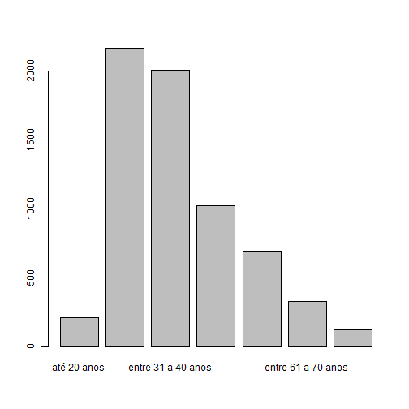
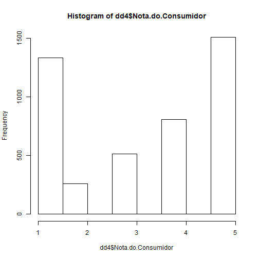

ANALISE R - ARQUIVOS DE DADOS
========================================================
author: GUILHERME LOURENCO 
date:RA 1700851 
autosize: TRUE

Dados Utilizados
========================================================

Com a proposta de analisar dados reais, esta apresentacao foi realizada como base no arquivo [_data4.txt_](https://drive.google.com/open?id=0Bwvb8KTG7ao9TjFTdGIzQzVCcjQ&authuser=0)

Para a conexao com os arquivo de de dados _data4.txt_, o seguinte comando foi utilizado:

```
dd4 <- read.table("data_4.txt", header = TRUE, sep = "\t", quote = NULL)

```


Quantidade de Registros
========================================================

Apos a conexao com os dados podemos visualizar a quantidade de registros na tabela importada.

Para isso, foi utilizado os seguintes comandos:

```
nrow(dd4): para visualizar a quantidade de linhas
ncol(dd4): para visualizar a quantidade de colunas

```
Quantidade de Registros
========================================================

Com a execucao dos comandos obtive os seguintes resultados:


```r
nrow(dd4) #total de linhas
```

```
[1] 6545
```

```r
ncol(dd4) #total de colunas
```

```
[1] 23
```

Analise das Variaveis
========================================================

Com a definicao das dimensoes da amostra, pude visualizar quais variavies estao disponiveis para analise atraves do seguinte comando:

<style>
body {
    overflow: scroll;
}
</style>


```r
names(dd4) #lista o nome das variaveis
```

```
 [1] "Região"                 "UF"                    
 [3] "Cidade"                 "Sexo"                  
 [5] "Faixa.Etária"           "Ano.Abertura"          
 [7] "Mês.Abertura"           "Data.Abertura"         
 [9] "Data.Resposta"          "Data.Finalização"      
[11] "Tempo.Resposta"         "Nome.Fantasia"         
[13] "Segmento.de.Mercado"    "Área"                  
[15] "Assunto"                "Grupo.Problema"        
[17] "Problema"               "Como.Comprou.Contratou"
[19] "Procurou.Empresa"       "Respondida"            
[21] "Situação"               "Avaliação.Reclamação"  
[23] "Nota.do.Consumidor"    
```

Exibicao de Registros
========================================================

Apos a definicao do tamanho da amostra e a identificacao das variaveis, pude exibir alguns registros para identificacao visual da tabela:


```r
head(dd4, 5) #exibe os 5 primeiros registros 
```

```
  Região UF               Cidade Sexo       Faixa.Etária Ano.Abertura
1     NE BA             Salvador    F entre 31 a 40 anos         2014
2     NE BA             Salvador    F entre 21 a 30 anos         2014
3     CO DF             Brasília    M entre 51 a 60 anos         2014
4     NE BA            Barreiras    M entre 21 a 30 anos         2014
5     CO GO Aparecida de Goiânia    M entre 21 a 30 anos         2014
  Mês.Abertura Data.Abertura Data.Resposta Data.Finalização Tempo.Resposta
1            9    30/09/2014    23/10/2014       13/11/2014             10
2            9    30/09/2014                     01/11/2014             NA
3           10    30/10/2014    07/11/2014       28/11/2014              8
4           10    31/10/2014    03/11/2014       10/11/2014              3
5           10    30/10/2014    06/11/2014       06/11/2014              7
        Nome.Fantasia
1         Casas Bahia
2                 Tim
3 Itaú BMG Consignado
4  Vivo - Telefônica 
5                 GVT
                                                      Segmento.de.Mercado
1                                                                  Varejo
2 Operadoras de Telecomunicações (Telefonia, Internet, TV por assinatura)
3                         Bancos, Financeiras e Administradoras de Cartão
4 Operadoras de Telecomunicações (Telefonia, Internet, TV por assinatura)
5 Operadoras de Telecomunicações (Telefonia, Internet, TV por assinatura)
                                 Área
1                     Demais Produtos
2                    Telecomunicações
3                Serviços Financeiros
4 Produtos de telefonia e informática
5                    Telecomunicações
                                                           Assunto
1                                                Móveis e Colchões
2                                         Telefonia Móvel Pós-paga
3 Crédito Consignado (Empréstimo descontado em folha de pagamento)
4                                  Demais aparelhos de comunicação
5                                     Pacote de Serviços ( Combo )
          Grupo.Problema
1     Vício de Qualidade
2      Contrato / Oferta
3     Vício de Qualidade
4 Cobrança / Contestação
5 Cobrança / Contestação
                                                                                     Problema
1 Produto danificado / não funciona - Dificuldade em trocar ou consertar no prazo de garantia
2          Oferta não cumprida / serviço não fornecido/ venda enganosa / publicidade enganosa
3                                                                 Portabilidade não efetivada
4              Cobrança por serviço/produto não contratado / não reconhecido / não solicitado
5           Cobrança por serviço não fornecido/ em desacordo com a utilização / fora do prazo
  Como.Comprou.Contratou Procurou.Empresa Respondida
1            Loja física                S          S
2               Telefone                S          N
3            Loja física                S          S
4               Telefone                S          S
5               Telefone                S          S
                 Situação Avaliação.Reclamação Nota.do.Consumidor
1 Finalizada não avaliada         Não Avaliada                 NA
2 Finalizada não avaliada         Não Avaliada                 NA
3 Finalizada não avaliada         Não Avaliada                 NA
4     Finalizada avaliada            Resolvida                  4
5     Finalizada avaliada            Resolvida                  4
```

Analise Descritiva
========================================================

Iniciando a analise descritiva da amostra, busquei mais informacoes sobre as variavies atres dos seguintes comandos:

```
- str(dd4): para analise da estrutura das variaveis

- summary(dd4): para analise da distribuicao dos dados

- describe(dd4): para analise geral da amostra
```

Analise Descritiva
========================================================


```r
str(dd4) #analise da estrutura das variaveis
```

```
'data.frame':	6545 obs. of  23 variables:
 $ Região                : Factor w/ 5 levels "CO","N ","NE",..: 3 3 1 3 1 1 4 5 5 3 ...
 $ UF                    : Factor w/ 27 levels "AC","AL","AM",..: 5 5 7 5 9 13 18 26 19 5 ...
 $ Cidade                : Factor w/ 858 levels "Abreu e Lima",..: 672 672 112 83 35 839 238 148 652 275 ...
 $ Sexo                  : Factor w/ 2 levels "F","M": 1 1 2 2 2 1 2 1 2 1 ...
 $ Faixa.Etária          : Factor w/ 7 levels "até 20 anos",..: 3 2 5 2 2 2 3 3 4 2 ...
 $ Ano.Abertura          : int  2014 2014 2014 2014 2014 2014 2014 2014 2014 2014 ...
 $ Mês.Abertura          : int  9 9 10 10 10 10 10 10 10 10 ...
 $ Data.Abertura         : Factor w/ 62 levels "01/10/2014","01/11/2014",..: 59 59 60 62 60 60 53 62 53 53 ...
 $ Data.Resposta         : Factor w/ 46 levels "","01/11/2014",..: 32 1 7 3 6 5 6 5 4 46 ...
 $ Data.Finalização      : Factor w/ 30 levels "01/11/2014","02/11/2014",..: 13 1 28 10 6 10 10 22 26 4 ...
 $ Tempo.Resposta        : int  10 NA 8 3 7 6 10 5 8 4 ...
 $ Nome.Fantasia         : Factor w/ 133 levels "Aliança do Brasil",..: 43 127 72 130 66 28 120 58 72 47 ...
 $ Segmento.de.Mercado   : Factor w/ 20 levels "Administradoras de Consórcios",..: 20 15 3 15 15 5 15 13 3 15 ...
 $ Área                  : Factor w/ 13 levels "Água, Energia, Gás",..: 3 11 10 7 11 10 11 3 10 11 ...
 $ Assunto               : Factor w/ 70 levels "Acessórios e periféricos ( monitor, impressora, pendrive, hd externo, cd dvd, outras midias, roteador, software, scanner etc)",..: 42 64 18 22 44 55 67 45 18 65 ...
 $ Grupo.Problema        : Factor w/ 7 levels "Atendimento / SAC",..: 7 3 7 2 2 3 2 3 2 2 ...
 $ Problema              : Factor w/ 105 levels "Alteração / rescisão de contrato sem solicitação / aviso prévio",..: 84 80 82 22 21 71 15 80 34 22 ...
 $ Como.Comprou.Contratou: Factor w/ 8 levels "Catálogo","Domicílio",..: 5 8 5 8 8 5 8 5 8 6 ...
 $ Procurou.Empresa      : Factor w/ 2 levels "N","S": 2 2 2 2 2 2 2 1 2 2 ...
 $ Respondida            : Factor w/ 2 levels "N","S": 2 1 2 2 2 2 2 2 2 2 ...
 $ Situação              : Factor w/ 2 levels "Finalizada avaliada",..: 2 2 2 1 1 1 1 1 2 1 ...
 $ Avaliação.Reclamação  : Factor w/ 3 levels "Não Avaliada",..: 1 1 1 3 3 2 3 2 1 3 ...
 $ Nota.do.Consumidor    : int  NA NA NA 4 4 1 4 1 NA 5 ...
```

Analise Descritiva
========================================================


```r
summary(dd4) #analise da distribuicao dos dados
```

```
 Região          UF                  Cidade     Sexo    
 CO: 626   SP     :1618   São Paulo     : 629   F:2530  
 N : 181   PR     : 895   Curitiba      : 440   M:4015  
 NE:1068   RJ     : 588   Rio de Janeiro: 355           
 S :1742   MG     : 562   Salvador      : 218           
 SE:2928   RS     : 455   Brasília      : 207           
           SC     : 392   Fortaleza     : 167           
           (Other):2035   (Other)       :4529           
             Faixa.Etária   Ano.Abertura   Mês.Abertura  
 até 20 anos       : 211   Min.   :2014   Min.   : 9.00  
 entre 21 a 30 anos:2169   1st Qu.:2014   1st Qu.:10.00  
 entre 31 a 40 anos:2008   Median :2014   Median :10.00  
 entre 41 a 50 anos:1024   Mean   :2014   Mean   :10.42  
 entre 51 a 60 anos: 690   3rd Qu.:2014   3rd Qu.:11.00  
 entre 61 a 70 anos: 325   Max.   :2014   Max.   :11.00  
 mais de 70 anos   : 118                                 
    Data.Abertura     Data.Resposta    Data.Finalização Tempo.Resposta  
 30/10/2014: 292   07/11/2014: 402   26/11/2014: 535    Min.   : 0.000  
 29/10/2014: 288   06/11/2014: 274   28/11/2014: 386    1st Qu.: 4.000  
 28/10/2014: 251   03/11/2014: 251   27/11/2014: 361    Median : 7.000  
 27/10/2014: 241   04/11/2014: 247   17/11/2014: 303    Mean   : 6.652  
 11/11/2014: 237   31/10/2014: 245   04/11/2014: 296    3rd Qu.: 9.000  
 21/10/2014: 219   30/10/2014: 232   21/11/2014: 295    Max.   :10.000  
 (Other)   :5017   (Other)   :4894   (Other)   :4369    NA's   :28      
            Nome.Fantasia 
 Oi Fixo           :1020  
 Vivo - Telefônica : 830  
 Tim               : 602  
 Claro Celular     : 379  
 SKY               : 333  
 Oi Celular        : 265  
 (Other)           :3116  
                                                              Segmento.de.Mercado
 Operadoras de Telecomunicações (Telefonia, Internet, TV por assinatura):3788    
 Bancos, Financeiras e Administradoras de Cartão                        :1165    
 Comércio Eletrônico                                                    : 927    
 Fabricantes - Eletroeletrônicos,  Produtos de Telefonia e Informática  : 245    
 Varejo                                                                 : 104    
 Transporte Aéreo                                                       :  75    
 (Other)                                                                : 241    
                                      Área     
 Telecomunicações                       :3200  
 Serviços Financeiros                   :1220  
 Produtos de telefonia e informática    : 960  
 Produtos Eletrodomésticos e Eletrônicos: 547  
 Demais Produtos                        : 365  
 Transportes                            :  80  
 (Other)                                : 173  
                     Assunto                    Grupo.Problema
 Telefonia Fixa          : 626   Atendimento / SAC     :1038  
 TV por Assinatura       : 531   Cobrança / Contestação:2144  
 Telefonia Móvel Pós-paga: 524   Contrato / Oferta     :1587  
 Aparelho celular        : 483   Entrega do Produto    : 278  
 Telefonia Móvel Pré-paga: 482   Informação            :  89  
 Internet Fixa           : 463   Saúde e Segurança     :  27  
 (Other)                 :3436   Vício de Qualidade    :1382  
                                                                               Problema   
 Oferta não cumprida / serviço não fornecido/ venda enganosa / publicidade enganosa:1079  
 Cobrança por serviço/produto não contratado / não reconhecido / não solicitado    : 548  
 Funcionamento inadequado do serviço (má qualidade do sinal, instabilidade, queda) : 539  
 SAC - Demanda não resolvida / não respondida                                      : 416  
 Dificuldade na devolução de valores pagos / reembolso / retenção de valores       : 280  
 Cobrança por serviço não fornecido/ em desacordo com a utilização / fora do prazo : 258  
 (Other)                                                                           :3425  
             Como.Comprou.Contratou Procurou.Empresa Respondida
 Telefone               :2096       N: 620           N:  28    
 Internet               :1593       S:5925           S:6517    
 Loja física            :1415                                  
 Não comprei / contratei:1073                                  
 Domicílio              : 220                                  
 Ganhei de presente     :  68                                  
 (Other)                :  80                                  
                    Situação       Avaliação.Reclamação Nota.do.Consumidor
 Finalizada avaliada    :4420   Não Avaliada :2125      Min.   :1.000     
 Finalizada não avaliada:2125   Não Resolvida:1458      1st Qu.:1.000     
                                Resolvida    :2962      Median :4.000     
                                                        Mean   :3.203     
                                                        3rd Qu.:5.000     
                                                        Max.   :5.000     
                                                        NA's   :2125      
```

Analise Descritiva
========================================================


```r
library("Hmisc") #utilizacao da Biblioteca "Hmisc"
describe(dd4) #analise geral da amostra
```

```
dd4 

 23  Variables      6545  Observations
---------------------------------------------------------------------------
Região 
       n  missing distinct 
    6545        0        5 
                                        
Value         CO     N    NE     S    SE
Frequency    626   181  1068  1742  2928
Proportion 0.096 0.028 0.163 0.266 0.447
---------------------------------------------------------------------------
UF 
       n  missing distinct 
    6545        0       27 

lowest : AC AL AM AP BA, highest: RS SC SE SP TO
---------------------------------------------------------------------------
Cidade 
       n  missing distinct 
    6545        0      858 

lowest : Abreu e Lima   Açailândia     Açu            Adrianópolis   Afonso Cláudio
highest: Volta Redonda  Votorantim     Votuporanga    Xangrilá       Xapuri        
---------------------------------------------------------------------------
Sexo 
       n  missing distinct 
    6545        0        2 
                      
Value          F     M
Frequency   2530  4015
Proportion 0.387 0.613
---------------------------------------------------------------------------
Faixa.Etária 
       n  missing distinct 
    6545        0        7 

até 20 anos (211, 0.032), entre 21 a 30 anos (2169, 0.331), entre 31 a 40
anos (2008, 0.307), entre 41 a 50 anos (1024, 0.156), entre 51 a 60 anos
(690, 0.105), entre 61 a 70 anos (325, 0.050), mais de 70 anos (118,
0.018)
---------------------------------------------------------------------------
Ano.Abertura 
       n  missing distinct     Info     Mean      Gmd 
    6545        0        1        0     2014        0 
               
Value      2014
Frequency  6545
Proportion    1
---------------------------------------------------------------------------
Mês.Abertura 
       n  missing distinct     Info     Mean      Gmd 
    6545        0        3    0.729    10.42   0.4864 
                            
Value          9    10    11
Frequency      2  3823  2720
Proportion 0.000 0.584 0.416
---------------------------------------------------------------------------
Data.Abertura 
       n  missing distinct 
    6545        0       62 

lowest : 01/10/2014 01/11/2014 02/10/2014 02/11/2014 03/10/2014
highest: 29/11/2014 30/09/2014 30/10/2014 30/11/2014 31/10/2014
---------------------------------------------------------------------------
Data.Resposta 
       n  missing distinct 
    6545        0       46 

lowest :            01/11/2014 03/11/2014 04/11/2014 05/11/2014
highest: 29/10/2014 29/11/2014 30/10/2014 30/11/2014 31/10/2014
---------------------------------------------------------------------------
Data.Finalização 
       n  missing distinct 
    6545        0       30 

lowest : 01/11/2014 02/11/2014 03/11/2014 04/11/2014 05/11/2014
highest: 26/11/2014 27/11/2014 28/11/2014 29/11/2014 30/11/2014
---------------------------------------------------------------------------
Tempo.Resposta 
       n  missing distinct     Info     Mean      Gmd      .05      .10 
    6517       28       11     0.98    6.652    3.377        1        2 
     .25      .50      .75      .90      .95 
       4        7        9       10       10 
                                                                      
Value          0     1     2     3     4     5     6     7     8     9
Frequency    153   378   395   360   389   463   477   705   848   841
Proportion 0.023 0.058 0.061 0.055 0.060 0.071 0.073 0.108 0.130 0.129
                
Value         10
Frequency   1508
Proportion 0.231
---------------------------------------------------------------------------
Nome.Fantasia 
       n  missing distinct 
    6545        0      133 

lowest : Aliança do Brasil       American Express - Amex Americanas.com          Amil                    AOC                    
highest: ViajaNet                Vivo - Telefônica       Walmart                 Walmart.com             Yasuda Marítima Seguros
---------------------------------------------------------------------------
Segmento.de.Mercado 
       n  missing distinct 
    6545        0       20 

lowest : Administradoras de Consórcios                                   Agências de Viagens                                             Bancos, Financeiras e Administradoras de Cartão                 Comércio Eletrônico                                             Corretoras e Sociedades de Seguros, Capitalização e Previdência
highest: Perfumaria, Cosméticos e Higiene Pessoal                        Programas de Fidelidade                                         Supermercados                                                   Transporte Aéreo                                                Varejo                                                         
---------------------------------------------------------------------------
Área 
       n  missing distinct 
    6545        0       13 

lowest : Água, Energia, Gás   Alimentos            Demais Produtos      Demais Serviços      Educação            
highest: Saúde                Serviços Financeiros Telecomunicações     Transportes          Turismo/Viagens     
---------------------------------------------------------------------------
Assunto 
       n  missing distinct 
    6545        0       70 

lowest : Acessórios e periféricos ( monitor, impressora, pendrive, hd externo, cd dvd, outras midias, roteador, software, scanner etc)                Aéreo                                                                                                                                        Alimentos para fins especiais (dietéticos, infantis, suplementos, gestantes, energéticos, isotônicos etc)                                    Aparelho celular                                                                                                                             Aparelho de som, video e imagem ( Câmera, filmadora, dvd, home theater etc)                                                                 
highest: Televisão                                                                                                                                    TV por Assinatura                                                                                                                            Utilidades Domésticas e Decoração (para limpeza, de cozinha, cama, mesa e banho, tapetes, cortinas, persianas, jardinagem, ferramentas etc.) Veículos – Peças e Acessórios (roda, pneu, rádio, farol, etc.)                                                                               Vestuário e Artigos de Uso Pessoal (roupa, calçados, jóias, bijuterias, malas, bolsas, etc)                                                 
---------------------------------------------------------------------------
Grupo.Problema 
       n  missing distinct 
    6545        0        7 

Atendimento / SAC (1038, 0.159), Cobrança / Contestação (2144, 0.328),
Contrato / Oferta (1587, 0.242), Entrega do Produto (278, 0.042),
Informação (89, 0.014), Saúde e Segurança (27, 0.004), Vício de Qualidade
(1382, 0.211)
---------------------------------------------------------------------------
Problema 
       n  missing distinct 
    6545        0      105 

lowest : Alteração / rescisão de contrato sem solicitação / aviso prévio             Alteração da apólice sem solicitação / aviso prévio                         Alteração de odor, sabor, aspecto ou composição química                     Alteração de plano/contrato sem solicitação ou aviso prévio                 Ausência  / Divergência de Preço                                           
highest: Serviço não realizado no prazo ou incompleto                                Suspensão ou desligamento indevido do serviço                               Venda casada                                                                Venda casada (garantia estendida, seguro, cursos etc)                       Venda casada (imposição de seguro, empréstimo, título de capitalização etc)
---------------------------------------------------------------------------
Como.Comprou.Contratou 
       n  missing distinct 
    6545        0        8 

Catálogo (22, 0.003), Domicílio (220, 0.034), Ganhei de presente (68,
0.010), Internet (1593, 0.243), Loja física (1415, 0.216), Não comprei /
contratei (1073, 0.164), Stand, feiras e eventos (58, 0.009), Telefone
(2096, 0.320)
---------------------------------------------------------------------------
Procurou.Empresa 
       n  missing distinct 
    6545        0        2 
                      
Value          N     S
Frequency    620  5925
Proportion 0.095 0.905
---------------------------------------------------------------------------
Respondida 
       n  missing distinct 
    6545        0        2 
                      
Value          N     S
Frequency     28  6517
Proportion 0.004 0.996
---------------------------------------------------------------------------
Situação 
       n  missing distinct 
    6545        0        2 
                                                          
Value          Finalizada avaliada Finalizada não avaliada
Frequency                     4420                    2125
Proportion                   0.675                   0.325
---------------------------------------------------------------------------
Avaliação.Reclamação 
       n  missing distinct 
    6545        0        3 
                                                    
Value       Não Avaliada Não Resolvida     Resolvida
Frequency           2125          1458          2962
Proportion         0.325         0.223         0.453
---------------------------------------------------------------------------
Nota.do.Consumidor 
       n  missing distinct     Info     Mean      Gmd 
    4420     2125        5    0.925    3.203    1.831 
                                        
Value          1     2     3     4     5
Frequency   1331   261   515   806  1507
Proportion 0.301 0.059 0.117 0.182 0.341
---------------------------------------------------------------------------
```

Visualizacao dos Dados
========================================================

Para auxiliar a analise descritiva podemos exibir os dados da amostra em graficos que auxiliem a analise.

Para que isso seja realizado pude utilizar os seguintes comandos:

```
- plot(dd4$Faixa.Etária)
- hist(dd4$Nota.do.Consumidor)

```

Visualizacao dos Dados
========================================================


```r
plot(dd4$Faixa.Etária)
```



Visualizacao dos Dados
========================================================


```r
hist(dd4$Nota.do.Consumidor)
```


